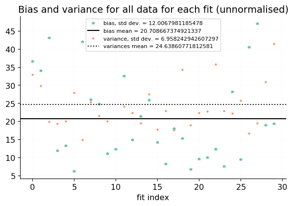
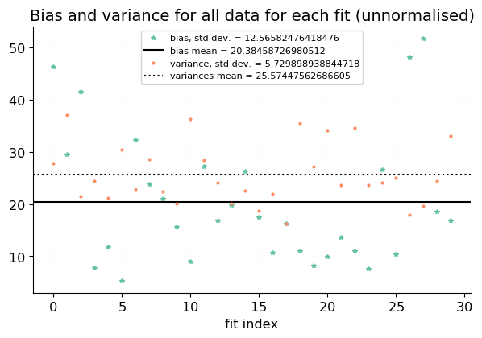
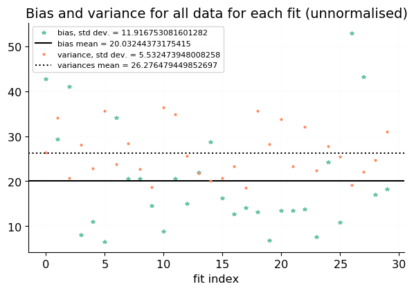
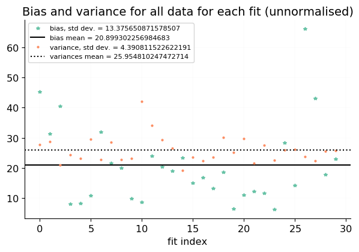

# plot of bias and variance across fits

## Using 10 replicas
 [.pdf](figures/n_reps_ns0_plot_total_fits_bias_variance.pdf) [#](#n_reps_ns0_plot_total_fits_bias_variance)](figures/n_reps_ns0_plot_total_fits_bias_variance.png){#n_reps_ns0_plot_total_fits_bias_variance} 

## Using 15 replicas
 [.pdf](figures/n_reps_ns1_plot_total_fits_bias_variance.pdf) [#](#n_reps_ns1_plot_total_fits_bias_variance)](figures/n_reps_ns1_plot_total_fits_bias_variance.png){#n_reps_ns1_plot_total_fits_bias_variance} 

## Using 20 replicas
 [.pdf](figures/n_reps_ns2_plot_total_fits_bias_variance.pdf) [#](#n_reps_ns2_plot_total_fits_bias_variance)](figures/n_reps_ns2_plot_total_fits_bias_variance.png){#n_reps_ns2_plot_total_fits_bias_variance} 

## Using 40 replicas
 [.pdf](figures/n_reps_ns3_plot_total_fits_bias_variance.pdf) [#](#n_reps_ns3_plot_total_fits_bias_variance)](figures/n_reps_ns3_plot_total_fits_bias_variance.png){#n_reps_ns3_plot_total_fits_bias_variance} 

