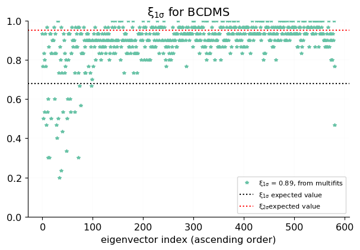
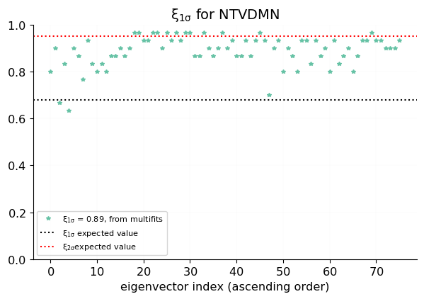
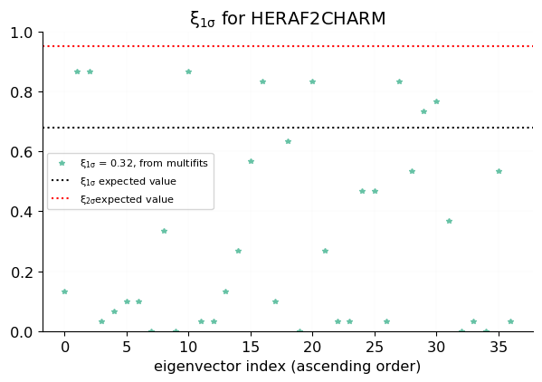
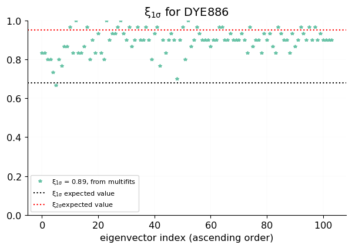
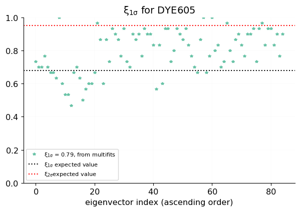
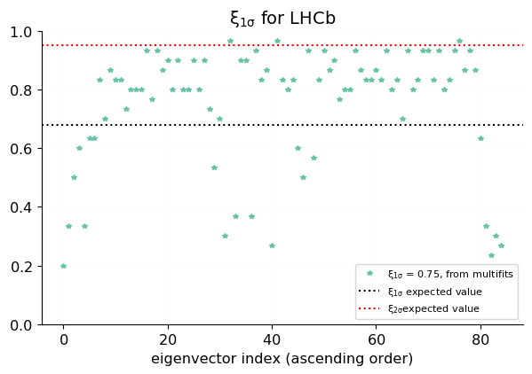

## sqrt(bias/variance)
<table border="0" class="dataframe">
<thead>
<tr style="text-align: right;">
<th></th>
<th>ndata</th>
<th>sqrt(bias/variance)</th>
</tr>
<tr>
<th>experiment</th>
<th></th>
<th></th>
</tr>
</thead>
<tbody>
<tr>
<th>NMC</th>
<td>325</td>
<td>0.6762</td>
</tr>
<tr>
<th>SLAC</th>
<td>67</td>
<td>0.5565</td>
</tr>
<tr>
<th>BCDMS</th>
<td>581</td>
<td>0.6371</td>
</tr>
<tr>
<th>CHORUS</th>
<td>832</td>
<td>0.6329</td>
</tr>
<tr>
<th>NTVDMN</th>
<td>76</td>
<td>0.6432</td>
</tr>
<tr>
<th>HERACOMB</th>
<td>1145</td>
<td>0.9291</td>
</tr>
<tr>
<th>HERAF2CHARM</th>
<td>37</td>
<td>1.635</td>
</tr>
<tr>
<th>F2BOTTOM</th>
<td>29</td>
<td>1.132</td>
</tr>
<tr>
<th>DYE886</th>
<td>104</td>
<td>0.6345</td>
</tr>
<tr>
<th>DYE605</th>
<td>85</td>
<td>0.9106</td>
</tr>
<tr>
<th>CDF</th>
<td>105</td>
<td>0.7488</td>
</tr>
<tr>
<th>D0</th>
<td>45</td>
<td>0.7655</td>
</tr>
<tr>
<th>ATLAS</th>
<td>360</td>
<td>0.7772</td>
</tr>
<tr>
<th>CMS</th>
<td>409</td>
<td>0.7652</td>
</tr>
<tr>
<th>LHCb</th>
<td>85</td>
<td>0.7311</td>
</tr>
<tr>
<th>Total</th>
<td>4285</td>
<td>0.7401</td>
</tr>
</tbody>
</table>

## expected/measured xi
<table border="0" class="dataframe">
<thead>
<tr style="text-align: right;">
<th></th>
<th>ndata</th>
<th>measured $\xi_{1\sigma}$</th>
<th>estimated $\xi_{1\sigma} \,$ from bias/variance</th>
</tr>
<tr>
<th>experiment</th>
<th></th>
<th></th>
<th></th>
</tr>
</thead>
<tbody>
<tr>
<th>NMC</th>
<td>325</td>
<td>0.8595</td>
<td>0.8608</td>
</tr>
<tr>
<th>SLAC</th>
<td>67</td>
<td>0.9239</td>
<td>0.9277</td>
</tr>
<tr>
<th>BCDMS</th>
<td>581</td>
<td>0.8931</td>
<td>0.8835</td>
</tr>
<tr>
<th>CHORUS</th>
<td>832</td>
<td>0.8657</td>
<td>0.8859</td>
</tr>
<tr>
<th>NTVDMN</th>
<td>76</td>
<td>0.8882</td>
<td>0.8800</td>
</tr>
<tr>
<th>HERACOMB</th>
<td>1145</td>
<td>0.6879</td>
<td>0.7182</td>
</tr>
<tr>
<th>HERAF2CHARM</th>
<td>37</td>
<td>0.3225</td>
<td>0.4593</td>
</tr>
<tr>
<th>F2BOTTOM</th>
<td>29</td>
<td>0.5368</td>
<td>0.6228</td>
</tr>
<tr>
<th>DYE886</th>
<td>104</td>
<td>0.8933</td>
<td>0.8850</td>
</tr>
<tr>
<th>DYE605</th>
<td>85</td>
<td>0.7906</td>
<td>0.7279</td>
</tr>
<tr>
<th>CDF</th>
<td>105</td>
<td>0.7594</td>
<td>0.8183</td>
</tr>
<tr>
<th>D0</th>
<td>45</td>
<td>0.7756</td>
<td>0.8085</td>
</tr>
<tr>
<th>ATLAS</th>
<td>360</td>
<td>0.7374</td>
<td>0.8018</td>
</tr>
<tr>
<th>CMS</th>
<td>409</td>
<td>0.7891</td>
<td>0.8087</td>
</tr>
<tr>
<th>LHCb</th>
<td>85</td>
<td>0.7522</td>
<td>0.8286</td>
</tr>
<tr>
<th>Total</th>
<td>4285</td>
<td>0.7911</td>
<td>0.8233</td>
</tr>
</tbody>
</table>

## xi by data point, grouped by experiment

 [.pdf](figures/experiments0_plot_experiment_xi.pdf) [#](#experiments0_plot_experiment_xi)](figures/experiments0_plot_experiment_xi.png){#experiments0_plot_experiment_xi} 

 [.pdf](figures/experiments1_plot_experiment_xi.pdf) [#](#experiments1_plot_experiment_xi)](figures/experiments1_plot_experiment_xi.png){#experiments1_plot_experiment_xi} 

 [.pdf](figures/experiments2_plot_experiment_xi.pdf) [#](#experiments2_plot_experiment_xi)](figures/experiments2_plot_experiment_xi.png){#experiments2_plot_experiment_xi} 

 [.pdf](figures/experiments3_plot_experiment_xi.pdf) [#](#experiments3_plot_experiment_xi)](figures/experiments3_plot_experiment_xi.png){#experiments3_plot_experiment_xi} 

 [.pdf](figures/experiments4_plot_experiment_xi.pdf) [#](#experiments4_plot_experiment_xi)](figures/experiments4_plot_experiment_xi.png){#experiments4_plot_experiment_xi} 

 [.pdf](figures/experiments5_plot_experiment_xi.pdf) [#](#experiments5_plot_experiment_xi)](figures/experiments5_plot_experiment_xi.png){#experiments5_plot_experiment_xi} 

 [.pdf](figures/experiments6_plot_experiment_xi.pdf) [#](#experiments6_plot_experiment_xi)](figures/experiments6_plot_experiment_xi.png){#experiments6_plot_experiment_xi} 

 [.pdf](figures/experiments7_plot_experiment_xi.pdf) [#](#experiments7_plot_experiment_xi)](figures/experiments7_plot_experiment_xi.png){#experiments7_plot_experiment_xi} 

 [.pdf](figures/experiments8_plot_experiment_xi.pdf) [#](#experiments8_plot_experiment_xi)](figures/experiments8_plot_experiment_xi.png){#experiments8_plot_experiment_xi} 

 [.pdf](figures/experiments9_plot_experiment_xi.pdf) [#](#experiments9_plot_experiment_xi)](figures/experiments9_plot_experiment_xi.png){#experiments9_plot_experiment_xi} 

 [.pdf](figures/experiments10_plot_experiment_xi.pdf) [#](#experiments10_plot_experiment_xi)](figures/experiments10_plot_experiment_xi.png){#experiments10_plot_experiment_xi} 

 [.pdf](figures/experiments11_plot_experiment_xi.pdf) [#](#experiments11_plot_experiment_xi)](figures/experiments11_plot_experiment_xi.png){#experiments11_plot_experiment_xi} 

 [.pdf](figures/experiments12_plot_experiment_xi.pdf) [#](#experiments12_plot_experiment_xi)](figures/experiments12_plot_experiment_xi.png){#experiments12_plot_experiment_xi} 

 [.pdf](figures/experiments13_plot_experiment_xi.pdf) [#](#experiments13_plot_experiment_xi)](figures/experiments13_plot_experiment_xi.png){#experiments13_plot_experiment_xi} 

 [.pdf](figures/experiments14_plot_experiment_xi.pdf) [#](#experiments14_plot_experiment_xi)](figures/experiments14_plot_experiment_xi.png){#experiments14_plot_experiment_xi} 

