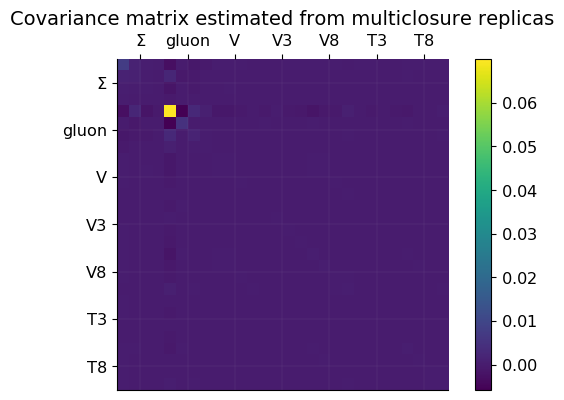
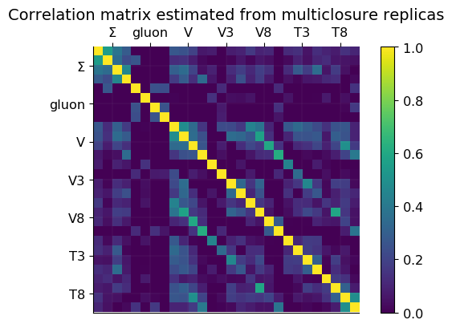
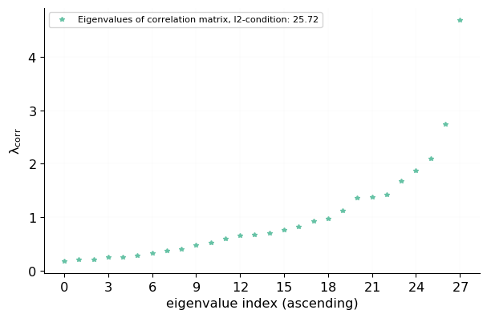
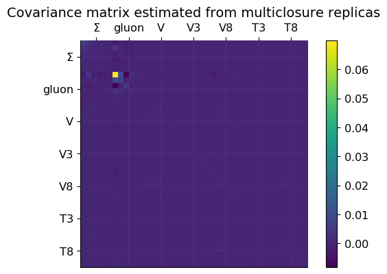
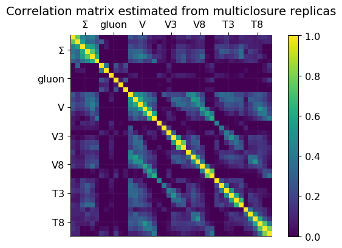
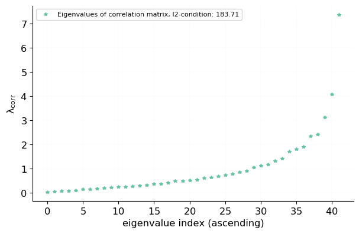
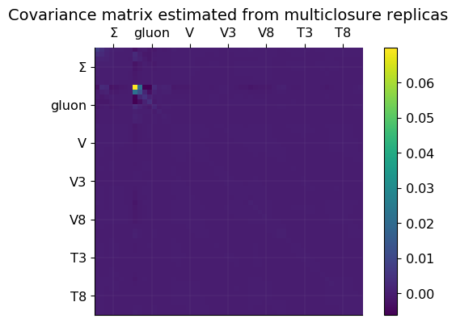
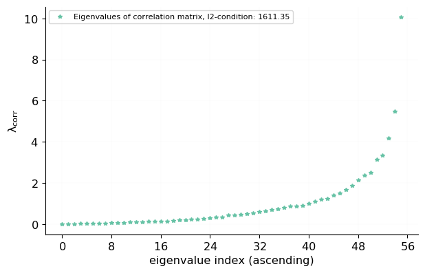
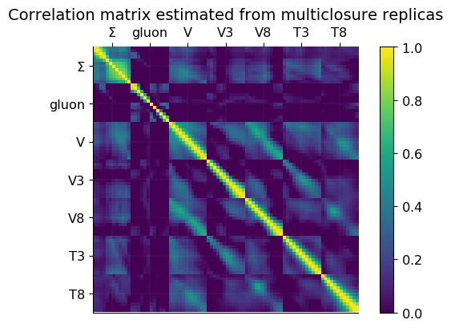
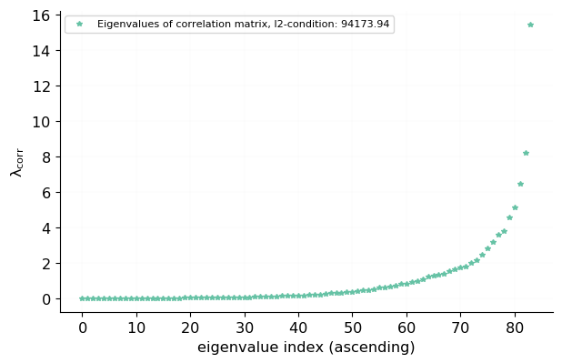

# Using 4 points in x
## covmat
 [.pdf](figures/N_x_ns0_plot_multiclosure_covariance_matrix.pdf) [#](#N_x_ns0_plot_multiclosure_covariance_matrix)](figures/N_x_ns0_plot_multiclosure_covariance_matrix.png){#N_x_ns0_plot_multiclosure_covariance_matrix} 

## corrmat
 [.pdf](figures/N_x_ns0_plot_multiclosure_correlation_matrix.pdf) [#](#N_x_ns0_plot_multiclosure_correlation_matrix)](figures/N_x_ns0_plot_multiclosure_correlation_matrix.png){#N_x_ns0_plot_multiclosure_correlation_matrix} 

### eigenvalues
 [.pdf](figures/N_x_ns0_plot_multiclosure_correlation_eigenvalues.pdf) [#](#N_x_ns0_plot_multiclosure_correlation_eigenvalues)](figures/N_x_ns0_plot_multiclosure_correlation_eigenvalues.png){#N_x_ns0_plot_multiclosure_correlation_eigenvalues} 

# Using 6 points in x
## covmat
 [.pdf](figures/N_x_ns1_plot_multiclosure_covariance_matrix.pdf) [#](#N_x_ns1_plot_multiclosure_covariance_matrix)](figures/N_x_ns1_plot_multiclosure_covariance_matrix.png){#N_x_ns1_plot_multiclosure_covariance_matrix} 

## corrmat
 [.pdf](figures/N_x_ns1_plot_multiclosure_correlation_matrix.pdf) [#](#N_x_ns1_plot_multiclosure_correlation_matrix)](figures/N_x_ns1_plot_multiclosure_correlation_matrix.png){#N_x_ns1_plot_multiclosure_correlation_matrix} 

### eigenvalues
 [.pdf](figures/N_x_ns1_plot_multiclosure_correlation_eigenvalues.pdf) [#](#N_x_ns1_plot_multiclosure_correlation_eigenvalues)](figures/N_x_ns1_plot_multiclosure_correlation_eigenvalues.png){#N_x_ns1_plot_multiclosure_correlation_eigenvalues} 

# Using 8 points in x
## covmat
 [.pdf](figures/N_x_ns2_plot_multiclosure_covariance_matrix.pdf) [#](#N_x_ns2_plot_multiclosure_covariance_matrix)](figures/N_x_ns2_plot_multiclosure_covariance_matrix.png){#N_x_ns2_plot_multiclosure_covariance_matrix} 

## corrmat
 [.pdf](figures/N_x_ns2_plot_multiclosure_correlation_matrix.pdf) [#](#N_x_ns2_plot_multiclosure_correlation_matrix)](figures/N_x_ns2_plot_multiclosure_correlation_matrix.png){#N_x_ns2_plot_multiclosure_correlation_matrix} 

### eigenvalues
 [.pdf](figures/N_x_ns2_plot_multiclosure_correlation_eigenvalues.pdf) [#](#N_x_ns2_plot_multiclosure_correlation_eigenvalues)](figures/N_x_ns2_plot_multiclosure_correlation_eigenvalues.png){#N_x_ns2_plot_multiclosure_correlation_eigenvalues} 

# Using 12 points in x
## covmat
 [.pdf](figures/N_x_ns3_plot_multiclosure_covariance_matrix.pdf) [#](#N_x_ns3_plot_multiclosure_covariance_matrix)](figures/N_x_ns3_plot_multiclosure_covariance_matrix.png){#N_x_ns3_plot_multiclosure_covariance_matrix} 

## corrmat
 [.pdf](figures/N_x_ns3_plot_multiclosure_correlation_matrix.pdf) [#](#N_x_ns3_plot_multiclosure_correlation_matrix)](figures/N_x_ns3_plot_multiclosure_correlation_matrix.png){#N_x_ns3_plot_multiclosure_correlation_matrix} 

### eigenvalues
 [.pdf](figures/N_x_ns3_plot_multiclosure_correlation_eigenvalues.pdf) [#](#N_x_ns3_plot_multiclosure_correlation_eigenvalues)](figures/N_x_ns3_plot_multiclosure_correlation_eigenvalues.png){#N_x_ns3_plot_multiclosure_correlation_eigenvalues} 

